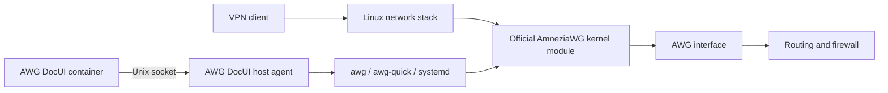

<!-- Derived from mycelium-mesh/amneziawg-ui (Apache-2.0) and modified by Bahonio. -->
<!-- SPDX-License-Identifier: Apache-2.0 AND AGPL-3.0-or-later -->

# AWG DocUI — AmneziaWG Web UI

A Web control panel for **AmneziaWG running in the Linux host kernel**.

The official AmneziaWG package and VPN traffic run on the host. Docker contains
only an unprivileged Web UI. Stopping or updating the container and the AWG
DocUI management agent does not stop VPN interfaces.

> The source is licensed and cleared for distribution. Public images and the
> quick install command below become available with the first tested release;
> provenance and the upstream permission record are preserved in [NOTICE](NOTICE).


## Quick install on a fresh VPS

Automated installation supports Ubuntu 22.04/24.04 and Debian 12 (bookworm)/13
(trixie) on `amd64` and `arm64`, using official distribution kernels with
headers available for the running kernel:

```sh
curl -fsSL -o /tmp/awg-docui-install.sh \
  https://github.com/Bahonio/amneziawg-docui/releases/latest/download/awg-docui-install.sh \
  && sudo sh /tmp/awg-docui-install.sh
```

On a fresh host, the installer:

1. enables the [official Amnezia PPA](https://launchpad.net/~amnezia/+archive/ubuntu/ppa)
   and the source repositories needed by DKMS;
2. installs headers for the running kernel, the official `amneziawg` package,
   DKMS, `awg` and `awg-quick`;
3. loads the kernel module and enables persistent IPv4 forwarding;
4. installs Docker Engine and Compose v2 from
   Docker's official repository for
   [Ubuntu](https://docs.docker.com/engine/install/ubuntu/) or
   [Debian](https://docs.docker.com/engine/install/debian/);
5. downloads the host agent and verifies its SHA-256 checksum;
6. starts the Web UI and prints a generated password.

On Debian, the installer uses Amnezia's `focal` PPA suite, as specified in
[Amnezia's Debian instructions](https://docs.amnezia.org/documentation/instructions/install-amneziawg-kernel-module-linux/).
It verifies the full signing-key fingerprint and scopes that key with
`Signed-By`, without `apt-key`. Debian source entries are added separately;
the existing binary repositories are preserved. Docker uses the Debian
`bookworm` or `trixie` repository. If headers for the running kernel are missing,
installation stops before installing AmneziaWG; install the matching headers
or reboot into an installed distribution kernel before retrying.

On a new interactive install, choose how to access the panel:

1. **SSH tunnel** (default): publish on `127.0.0.1`, then print the tunnel command.
2. **VPN / local network**: select a server IP from the list or enter it manually.
3. **Domain through a reverse proxy**: publish on loopback and enter the browser URL.
   Configure DNS and HTTPS separately; a proxy on the host must preserve the original
   `Host` header and forward to the printed loopback upstream.
4. **All interfaces**: publish on `0.0.0.0`; restrict access with your firewall.

Each option asks for the panel TCP port. IP addresses must belong to the server,
not to a VPN client. IPv4 and IPv6 are supported. The installer prints the effective
binding and browser URL; it does not change routing, firewall, DNS or reverse proxies.

For SSH access with the default port, open a tunnel:

```sh
ssh -L 54845:127.0.0.1:54845 root@SERVER_IP
```

Open `http://127.0.0.1:54845`, sign in as `admin` with the password printed by
the installer, then create the first interface and client in the UI.

For an unattended VPN install, use flags (the IP below is an example server address):

```sh
sudo sh /tmp/awg-docui-install.sh --adopt --access vpn --bind-address 10.66.66.1 --web-port 54845
```

Access flags skip the menu. `--access proxy` requires `--panel-url https://panel.example.com`.
`--bind-address` accepts an IP; a DNS name belongs in `--panel-url`. Without a terminal,
new installs keep loopback defaults. `--non-interactive` explicitly disables the menu.
Existing installs and updates keep their access settings unless changed by flags.
To reopen the menu on an installed panel, run:

```sh
sudo /opt/awg-docui/install.sh --configure-access
```

Manual Compose installations use `WEB_UI_BIND_ADDRESS`, `WEB_UI_PORT` and the optional
`WEB_UI_URL` in `.env`. The URL is for installer output only; it does not set up DNS,
TLS or redirects. Apply edits with `docker compose up -d` from the install directory.
The installer does not create a VPN interface without a user action.

It prints seven numbered stages. Complete command output is appended to
`/var/log/awg-docui/install.log` with mode `0600`; the generated Web password
is shown only in the terminal and is never written to that log.

## Host with an existing AmneziaWG installation

Use the explicit preservation mode:

```sh
curl -fsSL -o /tmp/awg-docui-install.sh \
  https://github.com/Bahonio/amneziawg-docui/releases/latest/download/awg-docui-install.sh \
  && sudo sh /tmp/awg-docui-install.sh --adopt
```

In this mode, the installer:

- does not run APT or change package repositories;
- does not install or load a kernel module;
- does not change sysctl;
- does not install or restart Docker;
- does not stop or restart existing VPN interfaces;
- does not change their keys, peers, ports, configs, firewall, or systemd
  enablement.

`amneziawg`, `awg`, `awg-quick`, Docker and Compose v2 must already be present.
If a requirement is missing, the installer stops and lists it.

Without a mode flag, detection is automatic. Any existing module, tool, host
config, interface, or VPN systemd unit selects `adopt`. Explicit `--fresh`
refuses to continue when an existing setup is found.

From a complete checkout, run the read-only preflight before attaching the
panel to a critical VPN:

```sh
sudo ./install-host-agent.sh --check
```

To verify preservation of a running `awg0`, keep a second SSH session open and
run:

```sh
sudo INTERFACE=awg0 ./scripts/test-existing-installation.sh
```

The check compares the config hash, identity, port, peers, ifindex, firewall,
and VPN unit InvocationID before and after management agent installation.

## Architecture



The container is outside the data path. It has no `NET_ADMIN`, `SYS_MODULE`,
`/dev/net/tun`, `/lib/modules`, or Docker socket. All capabilities are dropped
and its root filesystem is read-only.

The host agent listens only on `/run/awg-docui/agent.sock` and exposes a small
set of typed operations. It does not accept shell command strings. Root-owned
files in `/etc/amnezia/amneziawg/*.conf` remain the source of truth.

The socket directory is mounted read-only into the container. It survives agent
restarts and is recreated by systemd-tmpfiles at boot. `/status`, the Docker
healthcheck and the installer check connectivity through the panel's agent client.

The agent allows panel changes to an explicit set of interface settings.
Host DNS, routing tables, marks, addresses and hooks can only be preserved on
existing configs. New peer routes must be individual addresses inside the VPN
subnet; existing custom routes are retained only with their peer unchanged.
Client exports can still use a default route on the client device.

The panel is a trusted VPN administrator: access to the agent permits reading
VPN keys and creating, stopping or deleting VPN interfaces. It is not a security
boundary against all host network changes. Generated firewall rules allow VPN
clients to reach host services and forwarded networks, including other clients
and cloud metadata when reachable. Configure host firewall restrictions before
sharing access with untrusted clients.

Peer changes use live `awg syncconf` without cycling the interface. Before a
write, the agent creates a timestamped backup with mode `0600`.

## Updates

AmneziaWG, the Web UI, and the AWG DocUI host agent have separate update paths.

### Official AmneziaWG

The kernel module and `awg` tools come from Amnezia's official APT repository.
Update them through the operating system:

```sh
sudo apt update
sudo apt install --only-upgrade amneziawg
```

AWG DocUI does not replace or publish its own kernel module build. After a
kernel update, DKMS must build the module for the new kernel; the distribution determines
whether that update requires a reboot.

### Web UI only

A regular UI release can be pulled without changing the kernel module or host
agent:

```sh
cd /opt/awg-docui
sudo docker compose pull
sudo docker compose up -d
```

The installer uses the `latest` image tag by default, so `pull` retrieves the
latest stable Web UI. VPN traffic continues while Docker replaces the panel.

### Complete AWG DocUI management update

When release notes mention a host agent or Compose packaging change, run:

```sh
sudo /opt/awg-docui/install.sh --update
```

This downloads a checksummed release bundle and a new build of the AWG DocUI
agent, updates management files, and recreates the UI container. It does not
run `apt upgrade`, update official AmneziaWG packages, or restart a VPN unit.

To pin a specific release:

```sh
sudo /opt/awg-docui/install.sh --update --version v0.2.0
```

This selects image `0.2.0` instead of `latest`.

### Maintaining releases

Dependabot checks Go modules, the Docker base image, GitHub Actions, and the
Playwright package every Monday. It opens pull requests for available updates;
CI runs on each pull request and once a week. Review the changes and passing
checks before merging.

Every push to `main` automatically publishes the next patch version after all
CI jobs pass, including merged dependency updates. CI also installs official
AmneziaWG packages and builds DKMS modules against Debian 12/13 kernels on
native `amd64` and `arm64` runners. The release workflow builds the agent and image,
verifies the installer, and publishes the assets. If newer commits arrive
during CI, the older run leaves the release to the latest commit's CI.
Pull requests and scheduled CI runs only run checks.

To retry a failed release, rerun CI or manually run the CI workflow on `main`.
It reuses the commit's existing tag and skips published or active releases.
You can still push a `vX.Y.Z` tag for a minor or major version; subsequent
automatic releases increment its patch number. Check the release and image
before announcing the update. The image remains `ghcr.io/bahonio/awg-docui` so
existing installations continue to receive updates after the repository rename.

The official AmneziaWG kernel package is maintained by Amnezia through its PPA;
it is not a dependency bundled into this project. Review PPA package updates
separately and test them on a disposable host before upgrading a VPN server.

Run `make test-installer-sandbox` for isolated fresh/adopt/update checks,
including Debian repository selection and preservation of existing VPN files.
Run `make test-debian-packages` to download official packages and build modules
for Debian 12/13 on the local architecture. This check needs Docker and network
access. Containers verify compilation; loading a module and testing VPN traffic
require a real Debian host with the matching running kernel.

## Manual installation from a checkout

To install the host agent from source, run:

```sh
sudo ./install-host-agent.sh --check
sudo ./install-host-agent.sh
```

This requires the Go version in `go.mod`. Create `.env` and start a local Web UI
build:

```sh
cp .env.example .env
docker compose -f docker-compose.yml -f docker-compose.build.yml up -d --build
```

Copy the numeric GID printed by `install-host-agent.sh` to
`AWG_DOCUI_AGENT_GID`. `WEB_UI_PASSWORD` is a Base64-encoded SHA-256 digest:

```sh
printf '%s' 'choose-a-long-password' \
  | openssl dgst -sha256 -binary | base64
```

An image that is already present on the host can be passed to the bootstrap
without a registry pull:

```sh
sudo ./install.sh --adopt \
  --agent-binary ./awg-docui-agent-linux-amd64 \
  --image awg-docui:local \
  --no-pull
```

## Features

- Multiple host AmneziaWG interfaces.
- Create, update, suspend, restore and remove clients without restarting an
  interface.
- Export client `.conf`, QR codes and native AmneziaVPN `vpn://` links.
- Per-interface client endpoint: an automatically detected public IPv4 or an
  operator-supplied IPv4/DNS hostname, editable without restarting the VPN.
- Traffic, endpoint and latest-handshake data from the real `awg show` output.
- Complete AmneziaWG 3.x obfuscation parameters.
- Automatic discovery of existing interfaces and configs.
- Host systemd startup independent of Docker.
- English and Russian UI with no external browser requests.
- Basic authentication, same-origin mutation checks and restrictive browser
  security headers.

A client private key cannot be reconstructed from a server config. An adopted
peer can be monitored and managed, but its original client config cannot be
downloaded again.

Using a DNS hostname as the endpoint lets future server-IP migrations happen
through DNS without reissuing client configs. Changing an endpoint in the UI
affects future exports; configs already imported on client devices must be
edited or imported again.

## Health checks

```sh
systemctl status awg-docui-agent.service
curl --fail --unix-socket /run/awg-docui/agent.sock http://localhost/v1/health
awg show
cd /opt/awg-docui && sudo docker compose ps
```

## Backup

Host configs:

```sh
sudo tar -C /etc/amnezia -czf awg-host-configs.tgz amneziawg
```

Panel metadata containing client export material:

```sh
docker run --rm -v awg-docui-data:/data -v "$PWD":/backup:rw \
  alpine tar -C /data -czf /backup/awg-docui-metadata.tgz .
```

## Remove management components

```sh
sudo /opt/awg-docui/uninstall-host-agent.sh
cd /opt/awg-docui && sudo docker compose down
```

Host configs, backups, VPN units, active interfaces, routing and firewall are
preserved.

## License and source

AWG DocUI is distributed as a combined work under
[GNU AGPL-3.0-or-later](LICENSE). It contains code derived from
[`mycelium-mesh/amneziawg-ui`](https://github.com/mycelium-mesh/amneziawg-ui),
which is licensed under Apache-2.0. See [NOTICE](NOTICE),
[the Apache-2.0 text](LICENSES/Apache-2.0.txt), and
[third-party notices](THIRD_PARTY_NOTICES.txt). The final container is a
minimal scratch image; its Mozilla CA bundle is covered by
[MPL-2.0](LICENSES/MPL-2.0.txt). The canonical source is
[`Bahonio/amneziawg-docui`](https://github.com/Bahonio/amneziawg-docui).

AWG DocUI is an independent community project. It is not affiliated with or
endorsed by Amnezia. AmneziaWG belongs to its respective project and authors.
