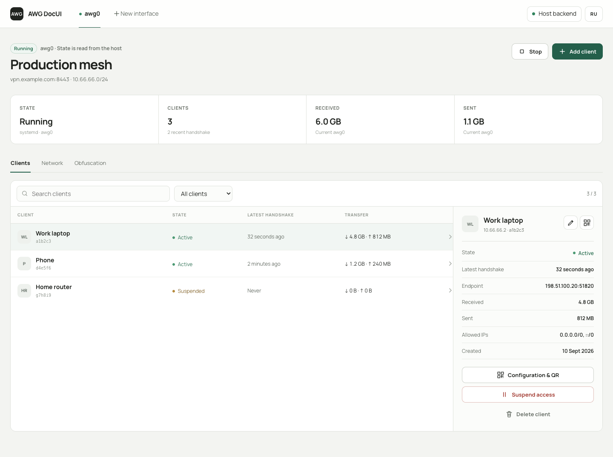
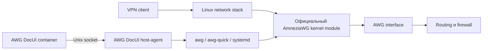

# AWG DocUI

Web-панель для **AmneziaWG, работающего через kernel module Linux host**.

Официальный AmneziaWG и передача VPN-трафика работают на host. Docker содержит
только непривилегированный Web UI. Остановка или обновление контейнера и нашего
management-agent не останавливают VPN-интерфейсы.

> Исходный код лицензирован и разрешён к распространению. Публичные образы и
> команда быстрой установки ниже станут доступны после первого проверенного
> релиза; происхождение кода и публичное разрешение записаны в [NOTICE](NOTICE).



## Быстрая установка на чистый VPS

Автоматическая установка поддерживает 64-битные Ubuntu 22.04 и 24.04 на
`amd64` и `arm64`, для которых сейчас опубликованы пакеты в официальном PPA
Amnezia:

```sh
curl -fsSL -o /tmp/awg-docui-install.sh \
  https://github.com/Bahonio/awg-docui/releases/latest/download/awg-docui-install.sh \
  && sudo sh /tmp/awg-docui-install.sh
```

На чистом host установщик:

1. подключает [официальный PPA Amnezia](https://launchpad.net/~amnezia/+archive/ubuntu/ppa);
2. устанавливает headers текущего kernel, официальный пакет `amneziawg`, DKMS,
   `awg` и `awg-quick`;
3. загружает kernel module и включает постоянный IPv4 forwarding;
4. устанавливает Docker Engine и Compose v2 из
   [официального Docker repository](https://docs.docker.com/engine/install/ubuntu/);
5. скачивает host-agent с SHA-256 проверкой;
6. запускает Web UI и печатает сгенерированный пароль.

Панель по умолчанию слушает только `127.0.0.1:54845`. Откройте SSH tunnel:

```sh
ssh -L 54845:127.0.0.1:54845 root@SERVER_IP
```

Затем откройте `http://127.0.0.1:54845`, войдите с логином `admin` и паролем,
который напечатал installer. В UI можно создать первый интерфейс и клиента.

Установщик не включает публичный доступ к панели и не создаёт VPN-интерфейс без
действия пользователя.

Installer показывает семь пронумерованных этапов. Полный вывод команд
добавляется в `/var/log/awg-docui/install.log` с правами `0600`; сгенерированный
пароль Web UI выводится только в терминал и никогда не записывается в лог.

## Сервер, где AmneziaWG уже работает

Используйте явный безопасный режим:

```sh
curl -fsSL -o /tmp/awg-docui-install.sh \
  https://github.com/Bahonio/awg-docui/releases/latest/download/awg-docui-install.sh \
  && sudo sh /tmp/awg-docui-install.sh --adopt
```

В этом режиме installer:

- не запускает APT и не меняет package repositories;
- не устанавливает и не загружает kernel module;
- не меняет sysctl;
- не устанавливает и не перезапускает Docker;
- не останавливает и не перезапускает существующие VPN interfaces;
- не меняет их keys, peers, ports, configs, firewall и systemd enablement.

`amneziawg`, `awg`, `awg-quick`, Docker и Compose v2 должны быть установлены
заранее. Если чего-то нет, installer завершится со списком отсутствующих
компонентов.

Без флагов режим выбирается автоматически. Любой найденный module, инструмент,
host config, interface или VPN systemd unit переводит установку в `adopt`.
Явный `--fresh` при обнаруженной установке завершается ошибкой.

Перед подключением панели к критичному VPN можно выполнить существующий
read-only preflight из полного checkout:

```sh
sudo ./install-host-agent.sh --check
```

Для проверки сохранения работающего `awg0` держите вторую SSH-сессию и
выполните:

```sh
sudo INTERFACE=awg0 ./scripts/test-existing-installation.sh
```

Скрипт сравнивает config hash, identity, port, peers, ifindex, firewall и
InvocationID VPN unit до и после установки management-agent.

## Как устроен проект



Контейнер не находится в data path. У него нет `NET_ADMIN`, `SYS_MODULE`,
`/dev/net/tun`, `/lib/modules` или Docker socket. Все capabilities удалены,
root filesystem доступна только для чтения.

Host-agent слушает только `/run/awg-docui/agent.sock` и предоставляет небольшой
набор типизированных операций. Он не принимает shell-команды. Host configs в
`/etc/amnezia/amneziawg/*.conf` остаются источником истины и принадлежат root.

Добавление и изменение peer выполняется через live `awg syncconf` без `down/up`
интерфейса. Перед записью создаётся timestamped backup с правами `0600`.

## Обновления

AmneziaWG, Web UI и AWG DocUI host-agent обновляются независимо.

### Официальный AmneziaWG

Kernel module и `awg` tools установлены из официального APT repository Amnezia.
Они обновляются стандартным способом:

```sh
sudo apt update
sudo apt install --only-upgrade amneziawg
```

AWG DocUI не заменяет и не публикует собственную сборку kernel module. После
обновления kernel DKMS должен собрать module для нового kernel; необходимость
reboot определяется обновлением Ubuntu.

### Только Web UI

Обычный UI-релиз можно получить через Docker без изменения kernel module или
host-agent:

```sh
cd /opt/awg-docui
sudo docker compose pull
sudo docker compose up -d
```

По умолчанию installer записывает image tag `latest`, поэтому `pull` получает
последний стабильный Web UI. VPN продолжает работать во время замены контейнера.

### Полное обновление AWG DocUI

Если release notes сообщают об изменении host-agent или Compose packaging:

```sh
sudo /opt/awg-docui/install.sh --update
```

Команда скачивает checksummed release bundle и новую версию нашего agent,
обновляет management-файлы и пересоздаёт UI-контейнер. Она не выполняет
`apt upgrade`, не обновляет официальный AmneziaWG и не перезапускает VPN unit.

Для закрепления конкретного release:

```sh
sudo /opt/awg-docui/install.sh --update --version v0.2.0
```

В этом случае Compose получает image `0.2.0` вместо `latest`.

## Ручная установка из checkout

Для закрытой разработки до публичного релиза можно поставить только наш
host-agent из исходников:

```sh
sudo ./install-host-agent.sh --check
sudo ./install-host-agent.sh
```

Для этого требуется версия Go из `go.mod`. Затем создайте `.env` и запустите
локальную сборку Web UI:

```sh
cp .env.example .env
docker compose -f docker-compose.yml -f docker-compose.build.yml up -d --build
```

Числовой GID, напечатанный `install-host-agent.sh`, нужно записать в
`AWG_DOCUI_AGENT_GID`. Пароль в `WEB_UI_PASSWORD` представляет собой Base64 от
SHA-256:

```sh
printf '%s' 'длинный-уникальный-пароль' \
  | openssl dgst -sha256 -binary | base64
```

Уже собранный локальный image можно передать bootstrap без registry pull:

```sh
sudo ./install.sh --adopt \
  --agent-binary ./awg-docui-agent-linux-amd64 \
  --image awg-docui:local \
  --no-pull
```

## Возможности

- несколько host AmneziaWG interfaces;
- создание, изменение, приостановка и удаление клиентов без restart interface;
- export `.conf`, QR и нативной ссылки `vpn://` для AmneziaVPN;
- отдельный endpoint для каждого interface: автоопределённый публичный IPv4
  либо заданный оператором IPv4/DNS hostname, без restart VPN при изменении;
- traffic, endpoint и latest handshake из реального `awg show`;
- полные параметры обфускации AmneziaWG 3.x;
- автоматическое обнаружение существующих interfaces и configs;
- автозапуск VPN через host systemd независимо от Docker;
- русская и английская локализация без внешних browser requests;
- Basic Auth, same-origin checks и строгие security headers.

Private key существующего клиента нельзя восстановить из server config.
Обнаруженный peer можно мониторить и управлять им, но его прежний client config
нельзя скачать заново.

DNS hostname в endpoint позволяет в дальнейшем переносить сервер сменой
DNS-записи без перевыпуска client configs. Изменение endpoint в UI применяется
к последующим export; уже импортированные на устройства configs нужно изменить
или импортировать заново.

## Проверка состояния

```sh
systemctl status awg-docui-agent.service
curl --fail --unix-socket /run/awg-docui/agent.sock http://localhost/v1/health
awg show
cd /opt/awg-docui && sudo docker compose ps
```

## Резервная копия

Host configs:

```sh
sudo tar -C /etc/amnezia -czf awg-host-configs.tgz amneziawg
```

Panel metadata с client export material:

```sh
docker run --rm -v awg-docui-data:/data -v "$PWD":/backup:rw \
  alpine tar -C /data -czf /backup/awg-docui-metadata.tgz .
```

## Удаление management-компонентов

```sh
sudo /opt/awg-docui/uninstall-host-agent.sh
cd /opt/awg-docui && sudo docker compose down
```

Host configs, backups, VPN units, активные interfaces, routing и firewall не
удаляются.

## Лицензия и исходный код

AWG DocUI распространяется как единая работа под
[GNU AGPL-3.0-or-later](LICENSE). Проект содержит код, производный от
[`mycelium-mesh/amneziawg-ui`](https://github.com/mycelium-mesh/amneziawg-ui),
который лицензирован под Apache-2.0. Подробности находятся в [NOTICE](NOTICE),
[тексте Apache-2.0](LICENSES/Apache-2.0.txt) и
[уведомлениях о сторонних компонентах](THIRD_PARTY_NOTICES.txt). Финальный
контейнер — минимальный scratch image; его Mozilla CA bundle покрыт
[MPL-2.0](LICENSES/MPL-2.0.txt). Канонический
исходный код: [`Bahonio/awg-docui`](https://github.com/Bahonio/awg-docui).

AWG DocUI — независимый community project, не связанный с Amnezia и не
одобренный ею. AmneziaWG принадлежит соответствующему проекту и авторам.
